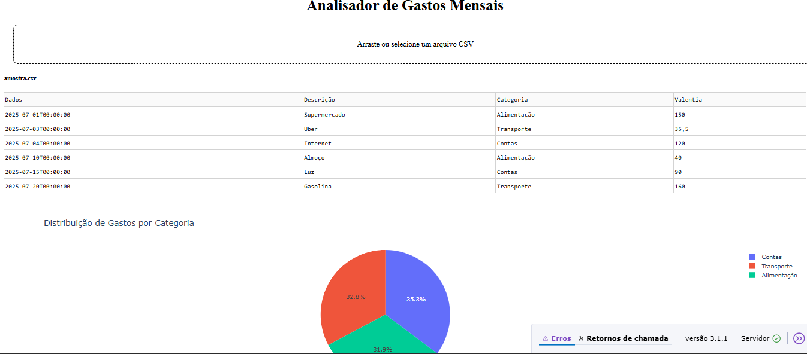

# 💰 Analisador de Gastos Mensais

Dashboard interativo para análise de despesas mensais a partir de arquivos CSV. O objetivo do projeto é facilitar o controle financeiro pessoal ou profissional, apresentando os gastos em formato de tabela e gráficos interativos, organizados por categoria.


## 📈 Funcionalidades

- Upload de arquivo `.csv` com os registros de gastos
- Visualização dos dados em tabela com paginação
- Gráfico de pizza mostrando a distribuição dos gastos por categoria
- Conversão automática da coluna de datas (se presente)
- Interface web simples, leve e responsiva usando Dash


## ⚙️ Tecnologias e Ferramentas Utilizadas

- **Python 3.11** – linguagem principal
- **Pandas** – para leitura e manipulação de dados
- **Plotly** – para gráficos interativos
- **Dash** – para construção da interface web
- **Visual Studio Code** – ambiente de desenvolvimento


## 📂 Exemplo de CSV Esperado

```csv
Data,Descrição,Categoria,Valor
2025-07-01,Supermercado,Alimentação,150.00
2025-07-03,Uber,Transporte,35.50
2025-07-04,Internet,Contas,120.00
2025-07-10,Almoço,Alimentação,40.00
2025-07-15,Luz,Contas,90.00
2025-07-20,Gasolina,Transporte,160.00


🖼️ Visualização do Dashboard




▶️ Como Executar Localmente
Clone o repositório:

git clone https://github.com/Eduuh007/analisador-gastos-mensais.git
cd analisador-gastos-mensais

Instale as dependências:

pip install -r requirements.txt

Execute o projeto:

python app.py

Acesse no navegador:

http://127.0.0.1:8050/

🙋‍♂️ Desenvolvido por

 Eduardo de Sousa Martins

 [GitHub: Eduuh007](https://github.com/Eduuh007)
 
[LinkedIn: Eduardo Martins](https://www.linkedin.com/in/eduardo-martins-575521245)

#Python #Dash #Plotly #Pandas #DataAnalysis #Finance #CSV #ControleFinanceiro #Dashboard #VisualizaçãoDeDados #GastosMensais #BudgetTracker #FinanceTracker #Analytics #PersonalFinance


# analisador-gastos-mensais
Analisador de Gastos Mensais interativo feito em Python com Dash, Pandas e Plotly. Permite upload de arquivos CSV para visualizar despesas por categoria em tabelas e gráficos dinâmicos, facilitando o controle financeiro pessoal ou empresarial.
